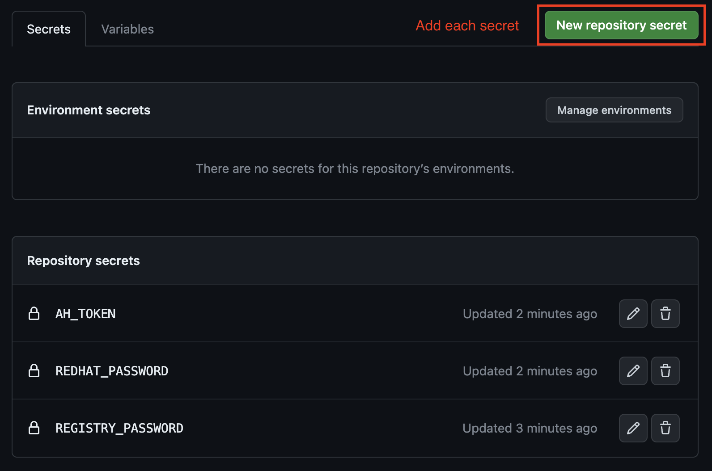
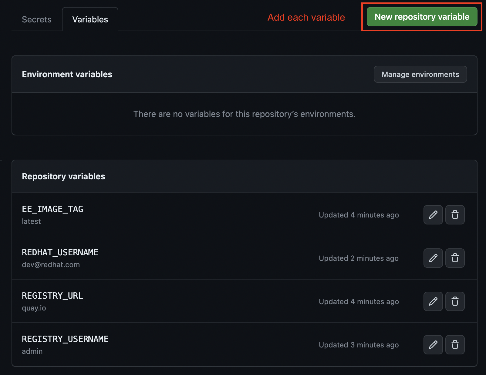

# ansible-ee-builder-template

Ansible Execution Environment builder template repository. Instantiate your own repository with EE definition files and have a DevOps workflow pre-configured.

## configuring the repository

Navigate to Settings > Under Security > View Secrets and Variables > Select Actions

  

## variables

| Name | Description | Example |
| --- | --- | --- |
| EE_IMAGE_TAG | Tag to apply to each image built (in addition to commit hash) | latest |
| REGISTRY_URL | URL for registry used to host images | hub.example.com |
| REGISTRY_USERNAME | Quay username for pushing to container registry | dev |
| REDHAT_USERNAME | Red Hat username for pulling official base images | dev@redhat.com |

## secrets

| Name | Description |
| --- | --- |
| REGISTRY_PASSWORD | Tag to apply to each image built (in addition to commit hash) |
| REDHAT_PASSWORD | Registry username for pushing images |
| AH_TOKEN | Automation Hub token for replacing placeholder value in ansible.cfg |

## definitions

| EE Name | Purpose | Docs |
| --- | --- | :---: |
| example-ee | Example EE for Windows workloads | [📝](./example-ee/execution-environment.yml) |